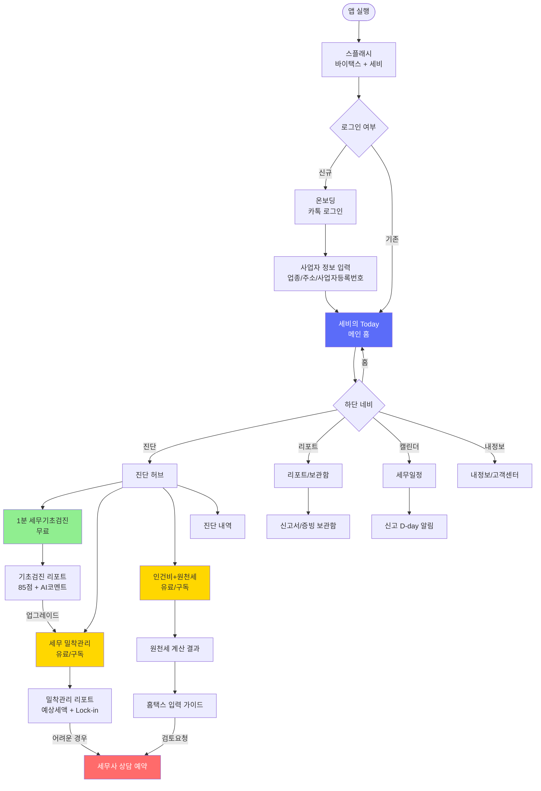
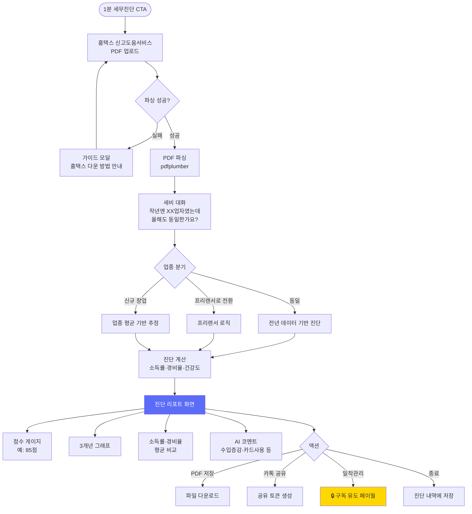
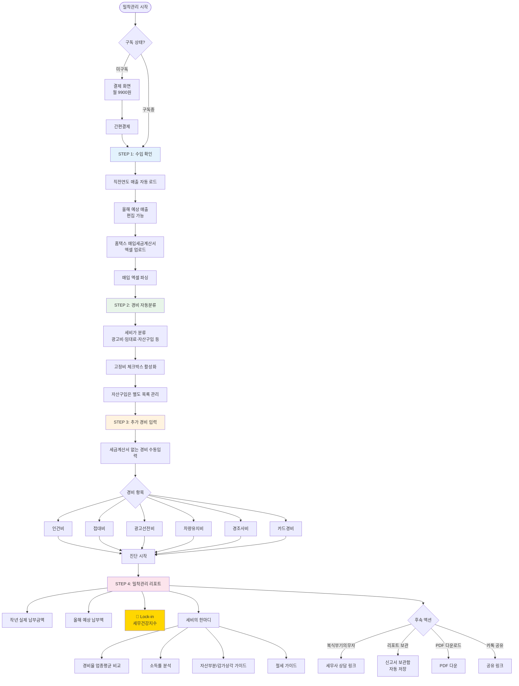
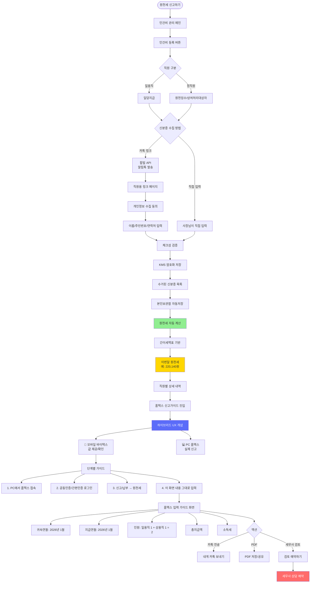
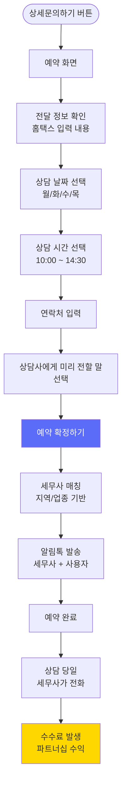
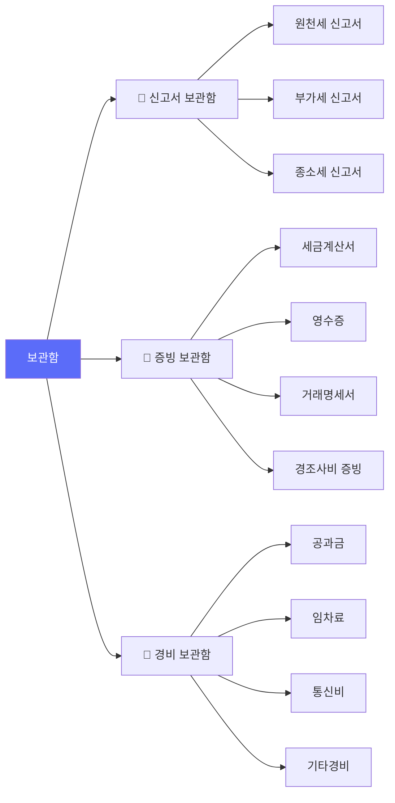
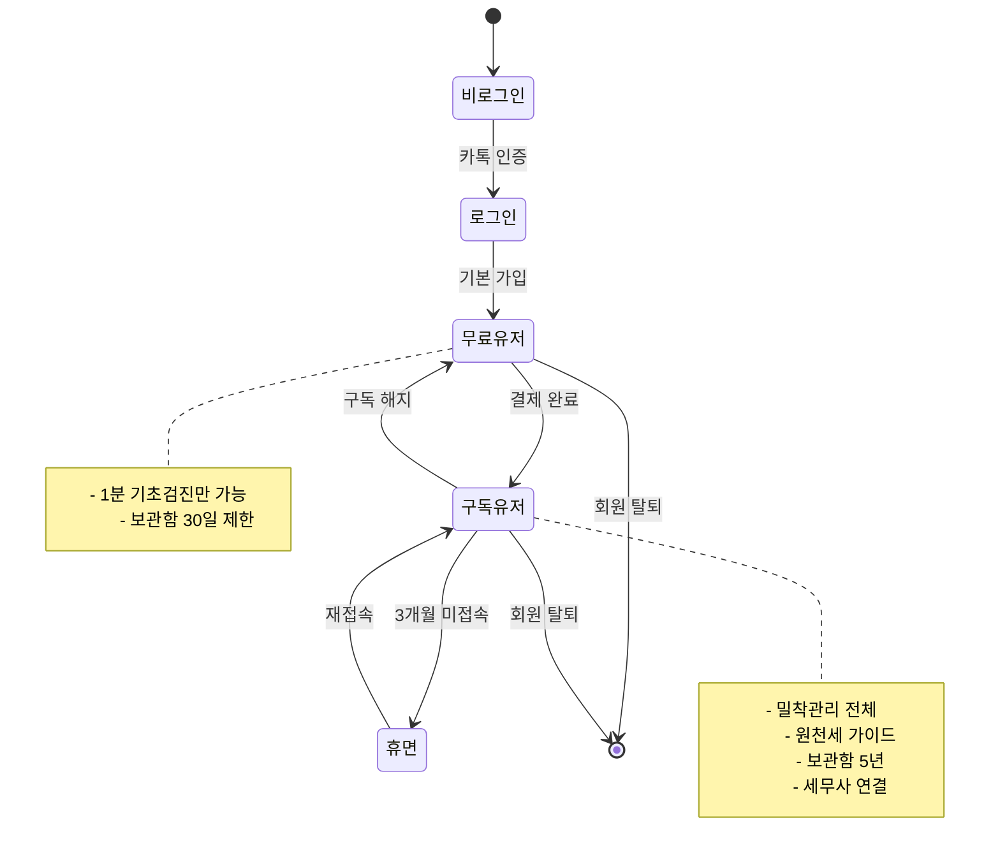

# ByeTax 전체 서비스 플로우차트

**작성일**: 2026-04-24
**작성자**: 코디 (Claude Opus 4.7)
**기반 자료**: `바이택스_화면구상.pdf` (19페이지)

---

## 📌 다이어그램 렌더링 방법

본 문서는 Mermaid 다이어그램으로 작성되었습니다. 다음 도구에서 렌더링 가능:
- **VS Code**: Markdown Preview Mermaid Support 확장
- **GitHub**: Markdown 파일 그대로 렌더링됨
- **온라인**: https://mermaid.live

---

## 1️⃣ 전체 사용자 여정 (Top Level)

---

## 2️⃣ 세무기초검진 (무료 진단) 상세

---

## 3️⃣ 세무 밀착관리 (유료) 상세

---

## 4️⃣ 인건비 등록 → 원천세 신고 가이드 (핵심 하이브리드 UX)

---

## 5️⃣ 세무사 상담 예약 플로우

---

## 6️⃣ 보관함 구조

---

## 7️⃣ 전체 상태 전환 (State Machine)

---

## 📊 화면 간 이동 매트릭스

| 출발 화면 | 도착 화면 | 트리거 |
|---|---|---|
| 홈 | 기초검진 | "1분 세무진단" 버튼 |
| 기초검진 리포트 | 밀착관리 | "세무 밀착관리 시작" (구독 유도) |
| 밀착관리 리포트 | 세무사 예약 | "복식부기의무자 세무사 상담" |
| 인건비 등록 | 원천세 계산 | "저장" → 자동 계산 |
| 원천세 계산 | 홈택스 가이드 | "홈택스 원천세 신고가이드" |
| 홈택스 가이드 | 세무사 예약 | "검토 예약하기" |
| 모든 리포트 | 보관함 | 자동 저장 (구독자) |
| 캘린더 | 기초검진 | 신고 D-day 이벤트 클릭 |

---

## 🎯 핵심 전환 포인트 (Conversion Points)

**핵심 KPI 측정 지점**:
1. `Visitor → Free` — 회원가입 전환율
2. `Free → FreeActive` — 1분 검진 완료율
3. `FreeActive → Sub` — 유료 전환율 (가장 중요)
4. `Sub → Premium` — 세무사 연결 전환율 (부가 수익)

---

## 📌 문서 끝

다음 단계: **02_의사결정_체크리스트.md** 참고
